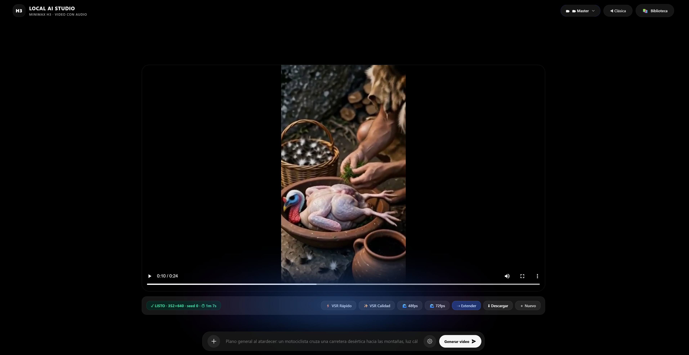

# 🎬 MiniMax H3 Studio

**A standalone, local web app for AI video + audio generation — a clean chat-style front end that drives your own [ComfyUI](https://github.com/comfyanonymous/ComfyUI) running the [MiniMax H3](https://huggingface.co/MiniMaxAI) omni model.**

No cloud, no login, no subscriptions. Everything runs on your machine and your GPU. You type a prompt, it generates a video **with synced audio**, saves it to a local SQLite library, and lets you organize, extend, upscale and stitch clips — all from one page.

> _Una app local para generar video + audio con IA sobre tu propio ComfyUI. Sin nube, sin cuentas, todo en tu máquina._

<p align="center">
  
</p>

---

## 🎥 Samples

<table>
<tr>
<td width="50%" align="center">

[](samples/sample-25s-native.mp4)

**▶ [25-second native generation](samples/sample-25s-native.mp4)**<br>
Single clip at 25 s native length (video + audio, no stitching).

</td>
<td width="50%" align="center">

[](samples/sample-2.5k.mp4)

**▶ [2.5K native generation](samples/sample-2.5k.mp4)**<br>
Clip generated at ~2.5K native resolution.

</td>
</tr>
</table>

_Click a thumbnail to play._

---

## ✨ Features

- **Chat-style creator** (`/new`) — black canvas + bottom composer. Write a prompt, get a video with audio.
- **Text-to-video, image-to-video, and reference** modes — plus **first frame** and **last frame** control.
- **Native duration in min:sec** — push the model toward its native length (up to the node's max), no post-stitching.
- **Native resolutions up to 2K / "4K"** — force higher resolutions to test what the model allows (with live time estimates).
- **Projects** — each project is its own library; a **Master** library shows them all. Move any video between projects.
- **🎬 Espacio Creativo** — a continuity editor: one big preview on top, a continuous timeline of clips below, **＋ new segment** / **⇢ extend** driven from the chat, proportional filmstrip + playhead, and **export the whole joined video**.
- **♻ Recreate with this setup** — every library video remembers its full setup (prompt, resolution, duration, seed, accelerators) and repopulates the composer in one click.
- **Background queue** — queue several videos; a finished one stays on screen while the next generates, with a live "⏳ Generando video…" pill.
- **Local upscaling (VSR)** and **RIFE frame interpolation** (48 / 72 fps) straight from the library.
- **Honest crash detection** — if ComfyUI runs out of VRAM and dies, the app tells you the truth instead of a fake 90%.

### ⚡ Speed accelerators (stackable, one-click)

| Accelerator | What it does | Notes |
|---|---|---|
| **Turbo LoRA** (4–8 steps) | Distilled LoRA + dedicated turbo sampler | The big, **stable** win (e.g. ~35 min → ~8 min at 768p on a 3090). On by default. |
| **Menos offload** (mem factor) | Keeps more of the model resident in VRAM | Helps short clips; auto-disabled on heavy configs. No quality change. |
| **Sage + EasyCache** | SageAttention (Triton) + feature caching | Fast, but the Triton kernel is **unstable on large/long shapes** — **auto-disabled** on 2K/4K and long clips, kept for standard-res short clips. |
| **Spectrum** | Chebyshev ridge forecasting that skips transformer evals | ~2× **only when compute-bound** (low res that fits VRAM). At 768p (offload-bound) it gives ~0 — use it for small clips. |

The app is built so heavy configs try to **fit instead of crashing** ComfyUI: it snaps dimensions to /32, auto-drops the unstable accelerators when a job is too big for 24 GB, and reports honestly when the backend dies.

---

## 🧩 Requirements

- **ComfyUI** with the **MiniMax H3** model stack installed (the diffusion UNET, the Qwen-based text encoder, and the video + audio VAEs). This app does **not** ship the models.
- **Python 3.10+** (standard library only — the Studio server has **no pip dependencies**).
- **ffmpeg / ffprobe** (for metadata + muxing).
- A CUDA GPU. Developed and tuned on an **RTX 3090 (24 GB)**.
- Optional custom nodes for the accelerators:
  - [`ComfyUI-MiniMax-H3-Turbo`](https://github.com/larryvrh) — Turbo LoRA sampler.
  - [`ComfyUI-Spectrum-MiniMax-H3`](https://github.com/xmarre) — Spectrum node.
  - KJNodes (SageAttention patch) and the FlashVSR / RIFE nodes for upscaling & interpolation.

### Models used (filenames the graphs expect)

```
minimax_h3_fl2va_pruned_int8_convrot.safetensors   # UNET (max quality)
minimax_h3_fl2va_pruned_int4_convrot.safetensors   # UNET (~11GB, fits VRAM = faster)
qwen3vl_32b_minimax_h3_int8_convrot.safetensors    # text encoder
minimax_h3_video_vae_fp16.safetensors              # video VAE
minimax_h3_audio_vae_fp32.safetensors              # audio VAE
minimax_h3_turbo_4step_ckpt500.safetensors         # Turbo LoRA (optional)
rife_v4.26.safetensors                             # frame interpolation (optional)
```

---

## 🤖 New to ComfyUI? Let an AI set it up for you

The trickiest part isn't this app — it's installing **ComfyUI** and downloading the **MiniMax H3** model stack correctly. You don't have to do it alone:

> **Hand this whole repo to an AI assistant like [Claude](https://claude.ai) (Claude Code is ideal) and ask it to guide you** — installing ComfyUI, downloading the MiniMax H3 models (UNET, text encoder, video + audio VAEs) into the right folders, wiring the shared model paths, and getting everything ready so the Studio just works.

A prompt that works well:

> _"I want to run this repo (MiniMax H3 Studio). Walk me step by step: install ComfyUI, download the MiniMax H3 models listed in the README into the correct folders, install the optional accelerator custom nodes, and configure the paths in `server.py` / `launch.py` for my machine, until I can open the Studio and generate a video."_

> _¿Nuevo en ComfyUI? Pásale este repo a una IA como **Claude** y pídele que te guíe paso a paso: instalar ComfyUI, descargar los modelos MiniMax H3 en las carpetas correctas, y dejar todo listo para que la app funcione._

---

## 🚀 Install & run

```bash
git clone https://github.com/reyjosias/minimax-h3-studio.git
cd minimax-h3-studio
python server.py            # serves the Studio on http://127.0.0.1:8199
```

Then open **http://127.0.0.1:8199/new**. Make sure ComfyUI is running on `http://127.0.0.1:8188` first.

**One-click (Windows):** `launch.py` / `start.bat` will start ComfyUI (if it isn't up), open the browser, and run the Studio. `reiniciar.bat` restarts the Studio, `apagar.bat` shuts it down.

### Configuration

The server reads a few environment variables and otherwise uses paths at the top of `server.py` / `launch.py`. **Edit these to match your machine:**

| Setting | Where | Default |
|---|---|---|
| ComfyUI URL | `COMFY_URL` env / `server.py` | `http://127.0.0.1:8188` |
| Studio port | `PORT` env / `server.py` | `8199` |
| Output dir | `OUTPUT_DIR` in `server.py` | ComfyUI's `output/` |
| Input dir | `INPUT_DIR` in `server.py` | ComfyUI's `input/` |
| ffmpeg / ffprobe | `FFMPEG` / `FFPROBE` in `server.py` | *(set to your ffmpeg path)* |
| ComfyUI dir / venv | `launch.py` | *(set to your ComfyUI install)* |

The SQLite library (`studio.db`) is created automatically on first run and is **git-ignored** (it's your personal library).

---

## 🖥️ Hardware notes (why the accelerators behave the way they do)

At **768p native** on a 24 GB 3090, generation is **offload-bound** — the ~20 GB model is streamed from RAM every step, so the bottleneck is memory bandwidth, not compute. That's why:

- **Step reducers** (Turbo LoRA) help a lot — fewer full model passes = less streaming.
- **Compute skippers** (Spectrum) help at **low resolution** (model fits VRAM, compute-bound) but ~nothing at 768p.
- **SageAttention** is fast but its Triton kernel throws `illegal memory access` on large/long shapes on Ampere — hence the auto-off logic.

The realistic next lever for 768p is **reducing offload** (int4 model that fits fully in VRAM) rather than skipping steps.

---

## 🙌 Author & contact

Built by **Rey Josias Reinoso**.

If this project helps you, or you have suggestions — or you'd like to **donate** to support the work — reach out on **X (Twitter): [@reyreinoso](https://x.com/reyreinoso)**.

Contributions, issues and pull requests are welcome. 🙏

---

## 📜 License

[MIT](LICENSE) © 2026 Rey Josias Reinoso
